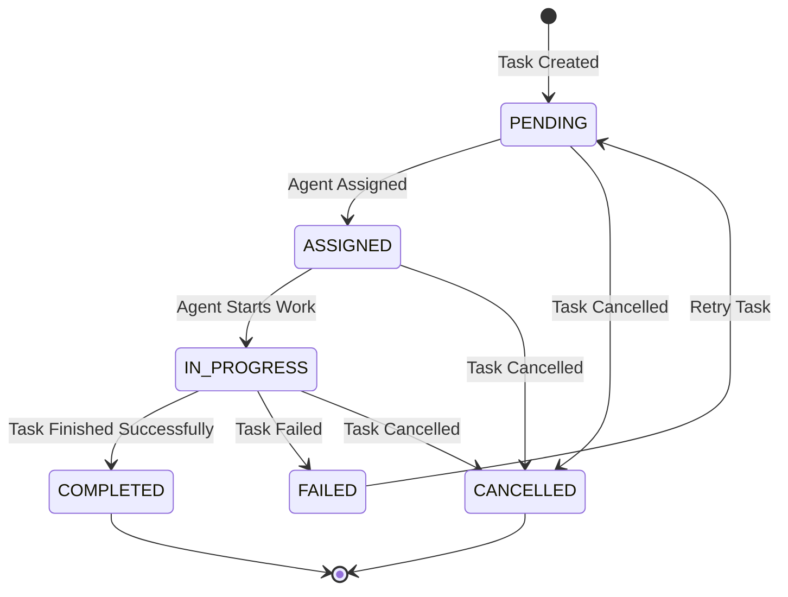
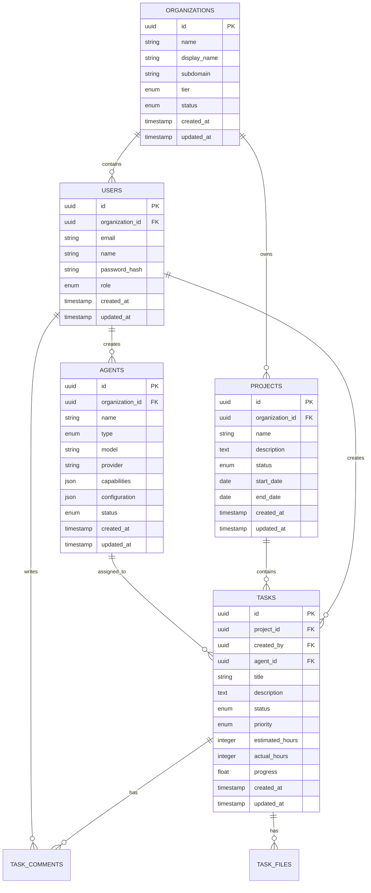

# Developer Guide

This comprehensive guide covers the architecture, development setup, coding standards, and contribution guidelines for the CoordinAItor project. Whether you're a core contributor or building integrations, this guide will help you understand and extend the system.

## Table of Contents

- [Architecture Overview](#architecture-overview)
- [Development Environment Setup](#development-environment-setup)
- [Project Structure](#project-structure)
- [Core Concepts](#core-concepts)
- [API Design](#api-design)
- [Database Schema](#database-schema)
- [Frontend Architecture](#frontend-architecture)
- [Testing Strategy](#testing-strategy)
- [Code Standards](#code-standards)
- [Contributing Guidelines](#contributing-guidelines)
- [Extension Points](#extension-points)
- [Performance Considerations](#performance-considerations)
- [Security Guidelines](#security-guidelines)

## Architecture Overview

### System Architecture

The CoordinAItor follows a modern, scalable microservices-inspired architecture:

```
┌─────────────────────────────────────────────────────────────┐
│                    Load Balancer (Nginx)                    │
├─────────────────────────────────────────────────────────────┤
│                       Web Layer                             │
│  ┌─────────────────┐  ┌─────────────────┐                  │
│  │   Web UI        │  │   API Gateway   │                  │
│  │   (React SPA)   │  │   (Express.js)  │                  │
│  └─────────────────┘  └─────────────────┘                  │
├─────────────────────────────────────────────────────────────┤
│                    Application Layer                        │
│  ┌─────────────────┐  ┌─────────────────┐  ┌─────────────┐ │
│  │ Task Manager    │  │ Agent Manager   │  │   WebSocket │ │
│  │ Service         │  │ Service         │  │   Server    │ │
│  └─────────────────┘  └─────────────────┘  └─────────────┘ │
├─────────────────────────────────────────────────────────────┤
│                     Integration Layer                       │
│  ┌─────────────────┐  ┌─────────────────┐  ┌─────────────┐ │
│  │ AI Provider     │  │ Queue System    │  │ Monitoring  │ │
│  │ Adapters        │  │ (Bull/Redis)    │  │ (Prometheus)│ │
│  └─────────────────┘  └─────────────────┘  └─────────────┘ │
├─────────────────────────────────────────────────────────────┤
│                      Data Layer                             │
│  ┌─────────────────┐  ┌─────────────────┐  ┌─────────────┐ │
│  │   PostgreSQL    │  │     Redis       │  │ File Storage│ │
│  │   (Primary DB)  │  │ (Cache/Queue)   │  │  (MinIO/S3) │ │
│  └─────────────────┘  └─────────────────┘  └─────────────┘ │
└─────────────────────────────────────────────────────────────┘
```

### Key Components

#### 1. API Gateway
- **Purpose**: Central entry point for all API requests
- **Technology**: Express.js with TypeScript
- **Responsibilities**:
  - Request routing and validation
  - Authentication and authorization
  - Rate limiting and throttling
  - Response formatting and error handling

#### 2. Task Management Service
- **Purpose**: Orchestrates task lifecycle and agent assignment
- **Key Features**:
  - Intelligent task decomposition
  - Agent selection and load balancing
  - Progress tracking and reporting
  - Failure handling and retry logic

#### 3. Agent Management Service
- **Purpose**: Manages AI agent instances and capabilities
- **Key Features**:
  - Agent registration and discovery
  - Health monitoring and failover
  - Capability matching and routing
  - Performance metrics collection

#### 4. WebSocket Server
- **Purpose**: Real-time communication and updates
- **Technology**: Socket.IO with Redis adapter
- **Key Features**:
  - Real-time task progress updates
  - Collaborative editing support
  - Presence and activity tracking
  - Horizontal scaling with Redis

#### 5. AI Provider Adapters
- **Purpose**: Standardized interface to AI services
- **Supported Providers**:
  - OpenAI (GPT models)
  - Anthropic (Claude models)
  - Google AI (Gemini models)
  - Azure OpenAI
  - AWS Bedrock

### Design Principles

1. **Modularity**: Clear separation of concerns with well-defined interfaces
2. **Scalability**: Horizontal scaling through stateless services
3. **Resilience**: Graceful failure handling and recovery mechanisms
4. **Extensibility**: Plugin architecture for custom integrations
5. **Observability**: Comprehensive logging, metrics, and tracing
6. **Security**: Defense in depth with multiple security layers

## Development Environment Setup

### Prerequisites

```bash
# System requirements
- Node.js 18.0+ and npm 9.0+
- PostgreSQL 15+
- Redis 7+
- Docker and Docker Compose
- Git

# Optional but recommended
- VS Code with recommended extensions
- Postman or similar API testing tool
- Database client (pgAdmin, DBeaver)
```

### Quick Setup

```bash
# 1. Clone the repository
git clone https://github.com/your-org/coordinaitor.git
cd coordinaitor

# 2. Install dependencies
npm install
cd web && npm install && cd ..

# 3. Set up environment variables
cp .env.example .env.development
# Edit .env.development with your configuration

# 4. Start development services
npm run docker:up

# 5. Run database migrations
npm run migration:run

# 6. Seed development data
npm run db:seed

# 7. Start development servers
npm run dev:all
```

### VS Code Configuration

Create `.vscode/settings.json`:

```json
{
  "typescript.preferences.importModuleSpecifier": "relative",
  "editor.formatOnSave": true,
  "editor.codeActionsOnSave": {
    "source.fixAll.eslint": true,
    "source.organizeImports": true
  },
  "files.exclude": {
    "**/node_modules": true,
    "**/dist": true,
    "**/.next": true
  },
  "search.exclude": {
    "**/node_modules": true,
    "**/dist": true,
    "**/.next": true
  },
  "typescript.preferences.includePackageJsonAutoImports": "auto"
}
```

Create `.vscode/extensions.json`:

```json
{
  "recommendations": [
    "ms-vscode.vscode-typescript-next",
    "bradlc.vscode-tailwindcss",
    "esbenp.prettier-vscode",
    "dbaeumer.vscode-eslint",
    "ms-vscode.vscode-json",
    "redhat.vscode-yaml",
    "ms-python.python",
    "ms-vscode.hexeditor"
  ]
}
```

### Development Scripts

```bash
# Backend development
npm run dev              # Start API server with hot reload
npm run build            # Build TypeScript to JavaScript
npm run test             # Run unit tests
npm run test:watch       # Run tests in watch mode
npm run test:coverage    # Run tests with coverage report

# Frontend development
cd web
npm run start            # Start React development server
npm run build            # Build production bundle
npm run test             # Run frontend tests
npm run storybook        # Start Storybook for component development

# Database operations
npm run migration:create # Create new migration
npm run migration:run    # Run pending migrations
npm run migration:revert # Revert last migration
npm run db:seed          # Seed database with test data

# Code quality
npm run lint             # Run ESLint
npm run lint:fix         # Fix ESLint issues automatically
npm run typecheck        # Run TypeScript type checking
npm run format           # Format code with Prettier

# Docker operations
npm run docker:build     # Build Docker images
npm run docker:up        # Start development services
npm run docker:down      # Stop development services
```

## Project Structure

```
coordinaitor/
├── src/                          # Backend source code
│   ├── controllers/              # API controllers
│   │   ├── auth.controller.ts
│   │   ├── task.controller.ts
│   │   ├── agent.controller.ts
│   │   └── project.controller.ts
│   ├── services/                 # Business logic services
│   │   ├── task.service.ts
│   │   ├── agent.service.ts
│   │   ├── ai-provider.service.ts
│   │   └── notification.service.ts
│   ├── models/                   # Database models (TypeORM)
│   │   ├── User.ts
│   │   ├── Task.ts
│   │   ├── Agent.ts
│   │   └── Project.ts
│   ├── middleware/               # Express middleware
│   │   ├── auth.middleware.ts
│   │   ├── validation.middleware.ts
│   │   ├── rate-limit.middleware.ts
│   │   └── error.middleware.ts
│   ├── routes/                   # API route definitions
│   │   ├── auth.routes.ts
│   │   ├── task.routes.ts
│   │   ├── agent.routes.ts
│   │   └── index.ts
│   ├── utils/                    # Utility functions
│   │   ├── logger.ts
│   │   ├── validation.ts
│   │   ├── crypto.ts
│   │   └── date-time.ts
│   ├── types/                    # TypeScript type definitions
│   │   ├── api.types.ts
│   │   ├── agent.types.ts
│   │   └── task.types.ts
│   ├── database/                 # Database configuration
│   │   ├── migrations/
│   │   ├── seeds/
│   │   ├── data-source.ts
│   │   └── entities/
│   ├── websocket/                # WebSocket server implementation
│   │   ├── websocket-server.ts
│   │   ├── handlers/
│   │   └── middleware/
│   ├── monitoring/               # Monitoring and metrics
│   │   ├── prometheus.ts
│   │   ├── health-check.ts
│   │   └── performance.ts
│   └── index.ts                  # Application entry point
├── web/                          # Frontend React application
│   ├── src/
│   │   ├── components/           # Reusable React components
│   │   │   ├── ui/               # Basic UI components
│   │   │   ├── forms/            # Form components
│   │   │   ├── layout/           # Layout components
│   │   │   └── features/         # Feature-specific components
│   │   ├── pages/                # Page components
│   │   │   ├── Dashboard/
│   │   │   ├── Tasks/
│   │   │   ├── Agents/
│   │   │   └── Projects/
│   │   ├── hooks/                # Custom React hooks
│   │   │   ├── useAuth.ts
│   │   │   ├── useWebSocket.ts
│   │   │   └── useApi.ts
│   │   ├── services/             # API service functions
│   │   │   ├── api.ts
│   │   │   ├── auth.service.ts
│   │   │   └── task.service.ts
│   │   ├── store/                # State management (Zustand)
│   │   │   ├── auth.store.ts
│   │   │   ├── task.store.ts
│   │   │   └── ui.store.ts
│   │   ├── types/                # TypeScript definitions
│   │   ├── utils/                # Utility functions
│   │   ├── styles/               # CSS and styling
│   │   └── App.tsx
│   ├── public/                   # Static assets
│   ├── package.json
│   └── tailwind.config.js
├── tests/                        # Test files
│   ├── unit/                     # Unit tests
│   ├── integration/              # Integration tests
│   ├── e2e/                      # End-to-end tests
│   └── fixtures/                 # Test data and fixtures
├── docs/                         # Documentation
├── scripts/                      # Build and utility scripts
├── k8s/                          # Kubernetes deployment files
├── docker/                       # Docker configuration
├── .github/                      # GitHub workflows and templates
├── package.json                  # Root package.json
├── tsconfig.json                 # TypeScript configuration
├── jest.config.js                # Jest test configuration
├── docker-compose.dev.yml        # Development Docker Compose
└── README.md
```

## Core Concepts

### Task Lifecycle

```typescript
enum TaskStatus {
  PENDING = 'pending',
  ASSIGNED = 'assigned',
  IN_PROGRESS = 'in_progress',
  COMPLETED = 'completed',
  FAILED = 'failed',
  CANCELLED = 'cancelled'
}

interface TaskLifecycle {
  created: Date;
  assigned?: Date;
  started?: Date;
  completed?: Date;
  failed?: Date;
  cancelled?: Date;
}
```

#### Task State Machine



### Agent Architecture

```typescript
interface Agent {
  id: string;
  name: string;
  type: AgentType;
  capabilities: string[];
  configuration: AgentConfig;
  status: AgentStatus;
  performance: AgentPerformance;
}

enum AgentType {
  CODING = 'coding',
  ANALYSIS = 'analysis',
  REVIEW = 'review',
  QA = 'qa',
  DOCUMENTATION = 'documentation'
}

interface AgentConfig {
  model: string;
  provider: string;
  maxConcurrentTasks: number;
  timeout: number;
  retryAttempts: number;
  customSettings: Record<string, any>;
}
```

### Event-Driven Architecture

The system uses an event-driven architecture for loose coupling:

```typescript
interface SystemEvent {
  id: string;
  type: string;
  payload: any;
  timestamp: Date;
  source: string;
  correlationId?: string;
}

// Event types
const EVENT_TYPES = {
  TASK_CREATED: 'task.created',
  TASK_ASSIGNED: 'task.assigned',
  TASK_COMPLETED: 'task.completed',
  TASK_FAILED: 'task.failed',
  AGENT_STATUS_CHANGED: 'agent.status_changed',
  USER_LOGGED_IN: 'user.logged_in',
  SYSTEM_HEALTH_CHANGED: 'system.health_changed'
} as const;
```

### Plugin System

```typescript
interface Plugin {
  name: string;
  version: string;
  description: string;
  dependencies: string[];
  init(context: PluginContext): Promise<void>;
  destroy(): Promise<void>;
}

interface PluginContext {
  app: Express;
  db: DataSource;
  logger: Logger;
  eventBus: EventBus;
  config: Config;
}

// Plugin registration
export class PluginManager {
  private plugins: Map<string, Plugin> = new Map();
  
  async loadPlugin(plugin: Plugin, context: PluginContext): Promise<void> {
    await plugin.init(context);
    this.plugins.set(plugin.name, plugin);
  }
  
  async unloadPlugin(name: string): Promise<void> {
    const plugin = this.plugins.get(name);
    if (plugin) {
      await plugin.destroy();
      this.plugins.delete(name);
    }
  }
}
```

## API Design

### RESTful Conventions

The API follows RESTful conventions with consistent patterns:

```typescript
// Resource naming
/api/v1/tasks           # Collection
/api/v1/tasks/{id}      # Individual resource
/api/v1/tasks/{id}/comments  # Sub-resource

// HTTP Methods
GET     /api/v1/tasks           # List resources
POST    /api/v1/tasks           # Create resource
GET     /api/v1/tasks/{id}      # Get resource
PUT     /api/v1/tasks/{id}      # Update resource (full)
PATCH   /api/v1/tasks/{id}      # Update resource (partial)
DELETE  /api/v1/tasks/{id}      # Delete resource

// Status Codes
200 OK                  # Successful GET, PUT, PATCH
201 Created            # Successful POST
204 No Content         # Successful DELETE
400 Bad Request        # Client error
401 Unauthorized       # Authentication required
403 Forbidden          # Authorization failed
404 Not Found          # Resource not found
422 Unprocessable      # Validation error
500 Internal Error     # Server error
```

### Request/Response Format

```typescript
// Standard request format
interface ApiRequest<T = any> {
  headers: {
    'Content-Type': 'application/json';
    'Authorization': 'Bearer <token>';
    'X-Request-ID': string;
  };
  body?: T;
  query?: Record<string, string>;
  params?: Record<string, string>;
}

// Standard response format
interface ApiResponse<T = any> {
  success: boolean;
  data?: T;
  error?: {
    code: string;
    message: string;
    details?: any;
  };
  meta?: {
    requestId: string;
    timestamp: string;
    version: string;
  };
  pagination?: {
    page: number;
    limit: number;
    total: number;
    pages: number;
    hasNext: boolean;
    hasPrev: boolean;
  };
}
```

### API Versioning

```typescript
// URL versioning (current approach)
/api/v1/tasks
/api/v2/tasks

// Header versioning (alternative)
headers: {
  'Accept': 'application/vnd.orchestrator.v1+json'
}

// Version compatibility
interface ApiVersion {
  version: string;
  deprecated: boolean;
  sunsetDate?: Date;
  migration?: {
    to: string;
    guide: string;
  };
}
```

### Error Handling

```typescript
// Custom error classes
export class ApiError extends Error {
  constructor(
    public statusCode: number,
    public code: string,
    message: string,
    public details?: any
  ) {
    super(message);
    this.name = 'ApiError';
  }
}

export class ValidationError extends ApiError {
  constructor(message: string, public errors: Record<string, string[]>) {
    super(422, 'VALIDATION_ERROR', message, errors);
  }
}

// Error middleware
export const errorHandler = (
  err: Error,
  req: Request,
  res: Response,
  next: NextFunction
) => {
  const errorId = generateErrorId();
  
  logger.error('API Error', err, {
    errorId,
    path: req.path,
    method: req.method,
    user: req.user?.id
  });

  if (err instanceof ApiError) {
    return res.status(err.statusCode).json({
      success: false,
      error: {
        code: err.code,
        message: err.message,
        details: err.details
      },
      meta: {
        errorId,
        timestamp: new Date().toISOString()
      }
    });
  }

  // Unknown error
  res.status(500).json({
    success: false,
    error: {
      code: 'INTERNAL_SERVER_ERROR',
      message: 'An unexpected error occurred'
    },
    meta: {
      errorId,
      timestamp: new Date().toISOString()
    }
  });
};
```

## Database Schema

### Entity Relationship Diagram



### Core Tables

#### Organizations Table

```sql
CREATE TABLE organizations (
    id UUID PRIMARY KEY DEFAULT gen_random_uuid(),
    name VARCHAR(100) NOT NULL UNIQUE,
    display_name VARCHAR(200) NOT NULL,
    subdomain VARCHAR(50) UNIQUE,
    tier VARCHAR(20) DEFAULT 'free' CHECK (tier IN ('free', 'pro', 'enterprise')),
    status VARCHAR(20) DEFAULT 'active' CHECK (status IN ('active', 'suspended', 'deleted')),
    settings JSONB DEFAULT '{}',
    created_at TIMESTAMP WITH TIME ZONE DEFAULT NOW(),
    updated_at TIMESTAMP WITH TIME ZONE DEFAULT NOW()
);

CREATE INDEX idx_organizations_subdomain ON organizations(subdomain);
CREATE INDEX idx_organizations_status ON organizations(status);
```

#### Users Table

```sql
CREATE TABLE users (
    id UUID PRIMARY KEY DEFAULT gen_random_uuid(),
    organization_id UUID NOT NULL REFERENCES organizations(id) ON DELETE CASCADE,
    email VARCHAR(255) NOT NULL,
    name VARCHAR(200) NOT NULL,
    password_hash VARCHAR(255) NOT NULL,
    role VARCHAR(20) DEFAULT 'user' CHECK (role IN ('admin', 'manager', 'user', 'viewer')),
    avatar_url VARCHAR(500),
    preferences JSONB DEFAULT '{}',
    last_login_at TIMESTAMP WITH TIME ZONE,
    created_at TIMESTAMP WITH TIME ZONE DEFAULT NOW(),
    updated_at TIMESTAMP WITH TIME ZONE DEFAULT NOW(),
    
    UNIQUE(organization_id, email)
);

CREATE INDEX idx_users_email ON users(email);
CREATE INDEX idx_users_organization_id ON users(organization_id);
CREATE INDEX idx_users_role ON users(role);
```

#### Tasks Table

```sql
CREATE TABLE tasks (
    id UUID PRIMARY KEY DEFAULT gen_random_uuid(),
    project_id UUID REFERENCES projects(id) ON DELETE SET NULL,
    created_by UUID NOT NULL REFERENCES users(id) ON DELETE RESTRICT,
    agent_id UUID REFERENCES agents(id) ON DELETE SET NULL,
    title VARCHAR(500) NOT NULL,
    description TEXT,
    status VARCHAR(20) DEFAULT 'pending' CHECK (status IN ('pending', 'assigned', 'in_progress', 'completed', 'failed', 'cancelled')),
    priority VARCHAR(10) DEFAULT 'medium' CHECK (priority IN ('low', 'medium', 'high', 'urgent')),
    tags TEXT[] DEFAULT '{}',
    estimated_hours INTEGER,
    actual_hours INTEGER,
    progress DECIMAL(3,2) DEFAULT 0.0 CHECK (progress >= 0 AND progress <= 1),
    due_date TIMESTAMP WITH TIME ZONE,
    started_at TIMESTAMP WITH TIME ZONE,
    completed_at TIMESTAMP WITH TIME ZONE,
    metadata JSONB DEFAULT '{}',
    created_at TIMESTAMP WITH TIME ZONE DEFAULT NOW(),
    updated_at TIMESTAMP WITH TIME ZONE DEFAULT NOW()
);

CREATE INDEX idx_tasks_status ON tasks(status);
CREATE INDEX idx_tasks_priority ON tasks(priority);
CREATE INDEX idx_tasks_created_by ON tasks(created_by);
CREATE INDEX idx_tasks_agent_id ON tasks(agent_id);
CREATE INDEX idx_tasks_project_id ON tasks(project_id);
CREATE INDEX idx_tasks_due_date ON tasks(due_date);
CREATE INDEX idx_tasks_tags ON tasks USING GIN(tags);
```

### Migration Strategy

```typescript
// Example migration
import { MigrationInterface, QueryRunner, Table, Index } from 'typeorm';

export class CreateTasksTable1640000000000 implements MigrationInterface {
  name = 'CreateTasksTable1640000000000';

  public async up(queryRunner: QueryRunner): Promise<void> {
    await queryRunner.createTable(
      new Table({
        name: 'tasks',
        columns: [
          {
            name: 'id',
            type: 'uuid',
            isPrimary: true,
            generationStrategy: 'uuid',
            default: 'gen_random_uuid()'
          },
          {
            name: 'title',
            type: 'varchar',
            length: '500',
            isNullable: false
          },
          {
            name: 'description',
            type: 'text',
            isNullable: true
          },
          {
            name: 'status',
            type: 'enum',
            enum: ['pending', 'assigned', 'in_progress', 'completed', 'failed', 'cancelled'],
            default: "'pending'"
          },
          {
            name: 'created_at',
            type: 'timestamp with time zone',
            default: 'NOW()'
          },
          {
            name: 'updated_at',
            type: 'timestamp with time zone',
            default: 'NOW()'
          }
        ]
      }),
      true
    );

    await queryRunner.createIndex(
      'tasks',
      new Index('idx_tasks_status', ['status'])
    );
  }

  public async down(queryRunner: QueryRunner): Promise<void> {
    await queryRunner.dropTable('tasks');
  }
}
```

## Frontend Architecture

### Component Architecture

```typescript
// Component hierarchy
App
├── Layout
│   ├── Header
│   │   ├── Navigation
│   │   ├── UserMenu
│   │   └── Notifications
│   ├── Sidebar
│   │   ├── ProjectSelector
│   │   └── NavigationMenu
│   └── Main
│       └── RouterOutlet
├── Pages
│   ├── Dashboard
│   ├── Tasks
│   │   ├── TaskList
│   │   ├── TaskDetail
│   │   └── TaskForm
│   ├── Agents
│   │   ├── AgentList
│   │   ├── AgentDetail
│   │   └── AgentForm
│   └── Projects
└── Providers
    ├── AuthProvider
    ├── ThemeProvider
    └── WebSocketProvider
```

### State Management

Using Zustand for state management:

```typescript
// stores/auth.store.ts
interface AuthState {
  user: User | null;
  token: string | null;
  isAuthenticated: boolean;
  isLoading: boolean;
  login: (credentials: LoginCredentials) => Promise<void>;
  logout: () => void;
  refreshToken: () => Promise<void>;
}

export const useAuthStore = create<AuthState>((set, get) => ({
  user: null,
  token: localStorage.getItem('token'),
  isAuthenticated: false,
  isLoading: false,

  login: async (credentials) => {
    set({ isLoading: true });
    try {
      const response = await authService.login(credentials);
      set({
        user: response.user,
        token: response.token,
        isAuthenticated: true,
        isLoading: false
      });
      localStorage.setItem('token', response.token);
    } catch (error) {
      set({ isLoading: false });
      throw error;
    }
  },

  logout: () => {
    set({
      user: null,
      token: null,
      isAuthenticated: false
    });
    localStorage.removeItem('token');
  },

  refreshToken: async () => {
    const { token } = get();
    if (!token) return;
    
    try {
      const response = await authService.refreshToken(token);
      set({ token: response.token });
      localStorage.setItem('token', response.token);
    } catch (error) {
      get().logout();
    }
  }
}));
```

### Custom Hooks

```typescript
// hooks/useWebSocket.ts
export function useWebSocket() {
  const [socket, setSocket] = useState<Socket | null>(null);
  const [isConnected, setIsConnected] = useState(false);
  const { user } = useAuthStore();

  useEffect(() => {
    if (!user) return;

    const newSocket = io(process.env.REACT_APP_WS_URL, {
      auth: { token: user.token },
      transports: ['websocket', 'polling']
    });

    newSocket.on('connect', () => {
      setIsConnected(true);
      console.log('WebSocket connected');
    });

    newSocket.on('disconnect', () => {
      setIsConnected(false);
      console.log('WebSocket disconnected');
    });

    setSocket(newSocket);

    return () => {
      newSocket.close();
    };
  }, [user]);

  const emit = useCallback((event: string, data: any) => {
    if (socket && isConnected) {
      socket.emit(event, data);
    }
  }, [socket, isConnected]);

  const subscribe = useCallback((event: string, handler: (data: any) => void) => {
    if (socket) {
      socket.on(event, handler);
      return () => socket.off(event, handler);
    }
  }, [socket]);

  return { socket, isConnected, emit, subscribe };
}

// hooks/useApi.ts
export function useApi<T>(
  url: string,
  options?: RequestInit
): {
  data: T | null;
  loading: boolean;
  error: Error | null;
  refetch: () => Promise<void>;
} {
  const [data, setData] = useState<T | null>(null);
  const [loading, setLoading] = useState(true);
  const [error, setError] = useState<Error | null>(null);

  const fetchData = useCallback(async () => {
    try {
      setLoading(true);
      setError(null);
      const response = await apiClient.get<T>(url, options);
      setData(response);
    } catch (err) {
      setError(err as Error);
    } finally {
      setLoading(false);
    }
  }, [url, options]);

  useEffect(() => {
    fetchData();
  }, [fetchData]);

  return { data, loading, error, refetch: fetchData };
}
```

### Component Patterns

```typescript
// Compound component pattern
export const TaskCard = {
  Root: ({ children, task }: { children: React.ReactNode; task: Task }) => (
    <div className="task-card" data-testid={`task-${task.id}`}>
      <TaskProvider task={task}>
        {children}
      </TaskProvider>
    </div>
  ),
  
  Header: ({ children }: { children: React.ReactNode }) => (
    <div className="task-card-header">{children}</div>
  ),
  
  Title: () => {
    const { task } = useTask();
    return <h3 className="task-title">{task.title}</h3>;
  },
  
  Status: () => {
    const { task } = useTask();
    return <span className={`status status-${task.status}`}>{task.status}</span>;
  },
  
  Actions: ({ children }: { children: React.ReactNode }) => (
    <div className="task-actions">{children}</div>
  )
};

// Usage
<TaskCard.Root task={task}>
  <TaskCard.Header>
    <TaskCard.Title />
    <TaskCard.Status />
  </TaskCard.Header>
  <TaskCard.Actions>
    <Button onClick={() => editTask(task.id)}>Edit</Button>
    <Button onClick={() => deleteTask(task.id)}>Delete</Button>
  </TaskCard.Actions>
</TaskCard.Root>
```

## Testing Strategy

### Test Pyramid

```
    /\
   /  \    E2E Tests (Few)
  /____\   - Critical user journeys
 /      \  - Cross-browser testing
/________\ Integration Tests (Some)
           - API endpoints
           - Database interactions
           - Service integrations
___________________
Unit Tests (Many)
- Pure functions
- Component logic
- Business logic
```

### Unit Testing

```typescript
// services/task.service.test.ts
import { TaskService } from './task.service';
import { Task, TaskStatus } from '../types/task.types';

describe('TaskService', () => {
  let taskService: TaskService;
  let mockRepository: jest.Mocked<TaskRepository>;

  beforeEach(() => {
    mockRepository = {
      findById: jest.fn(),
      save: jest.fn(),
      delete: jest.fn(),
      findByStatus: jest.fn()
    } as any;
    
    taskService = new TaskService(mockRepository);
  });

  describe('createTask', () => {
    it('should create a task with pending status', async () => {
      const taskData = {
        title: 'Test Task',
        description: 'Test Description',
        projectId: 'project-1'
      };

      const expectedTask: Task = {
        id: 'task-1',
        ...taskData,
        status: TaskStatus.PENDING,
        createdAt: new Date(),
        updatedAt: new Date()
      };

      mockRepository.save.mockResolvedValue(expectedTask);

      const result = await taskService.createTask(taskData);

      expect(result).toEqual(expectedTask);
      expect(mockRepository.save).toHaveBeenCalledWith(
        expect.objectContaining({
          ...taskData,
          status: TaskStatus.PENDING
        })
      );
    });

    it('should throw error for invalid task data', async () => {
      const invalidTaskData = { title: '' }; // Missing required fields

      await expect(taskService.createTask(invalidTaskData as any))
        .rejects
        .toThrow('Invalid task data');
    });
  });

  describe('assignTask', () => {
    it('should assign task to agent and update status', async () => {
      const taskId = 'task-1';
      const agentId = 'agent-1';
      const existingTask: Task = {
        id: taskId,
        title: 'Test Task',
        status: TaskStatus.PENDING,
        createdAt: new Date(),
        updatedAt: new Date()
      } as Task;

      mockRepository.findById.mockResolvedValue(existingTask);
      mockRepository.save.mockResolvedValue({
        ...existingTask,
        agentId,
        status: TaskStatus.ASSIGNED
      });

      const result = await taskService.assignTask(taskId, agentId);

      expect(result.agentId).toBe(agentId);
      expect(result.status).toBe(TaskStatus.ASSIGNED);
      expect(mockRepository.save).toHaveBeenCalledWith(
        expect.objectContaining({
          agentId,
          status: TaskStatus.ASSIGNED
        })
      );
    });
  });
});
```

### Integration Testing

```typescript
// tests/integration/task.api.test.ts
import request from 'supertest';
import { app } from '../../src/app';
import { setupTestDatabase, cleanupTestDatabase } from '../helpers/database';
import { createTestUser, createAuthToken } from '../helpers/auth';

describe('Task API', () => {
  let authToken: string;
  let userId: string;

  beforeAll(async () => {
    await setupTestDatabase();
    const user = await createTestUser();
    userId = user.id;
    authToken = createAuthToken(user);
  });

  afterAll(async () => {
    await cleanupTestDatabase();
  });

  describe('POST /api/v1/tasks', () => {
    it('should create a new task', async () => {
      const taskData = {
        title: 'Integration Test Task',
        description: 'Test task creation via API',
        priority: 'high'
      };

      const response = await request(app)
        .post('/api/v1/tasks')
        .set('Authorization', `Bearer ${authToken}`)
        .send(taskData)
        .expect(201);

      expect(response.body.success).toBe(true);
      expect(response.body.data).toMatchObject({
        title: taskData.title,
        description: taskData.description,
        priority: taskData.priority,
        status: 'pending',
        createdBy: userId
      });
      expect(response.body.data.id).toBeDefined();
    });

    it('should return validation error for invalid data', async () => {
      const invalidTaskData = {
        title: '', // Empty title should fail validation
        priority: 'invalid' // Invalid priority
      };

      const response = await request(app)
        .post('/api/v1/tasks')
        .set('Authorization', `Bearer ${authToken}`)
        .send(invalidTaskData)
        .expect(422);

      expect(response.body.success).toBe(false);
      expect(response.body.error.code).toBe('VALIDATION_ERROR');
      expect(response.body.error.details).toHaveProperty('title');
      expect(response.body.error.details).toHaveProperty('priority');
    });

    it('should return 401 for unauthenticated requests', async () => {
      const taskData = {
        title: 'Test Task',
        description: 'Test Description'
      };

      await request(app)
        .post('/api/v1/tasks')
        .send(taskData)
        .expect(401);
    });
  });

  describe('GET /api/v1/tasks', () => {
    beforeEach(async () => {
      // Create test tasks
      await request(app)
        .post('/api/v1/tasks')
        .set('Authorization', `Bearer ${authToken}`)
        .send({ title: 'Task 1', status: 'pending' });
      
      await request(app)
        .post('/api/v1/tasks')
        .set('Authorization', `Bearer ${authToken}`)
        .send({ title: 'Task 2', status: 'completed' });
    });

    it('should return paginated list of tasks', async () => {
      const response = await request(app)
        .get('/api/v1/tasks?page=1&limit=10')
        .set('Authorization', `Bearer ${authToken}`)
        .expect(200);

      expect(response.body.success).toBe(true);
      expect(response.body.data).toBeInstanceOf(Array);
      expect(response.body.pagination).toMatchObject({
        page: 1,
        limit: 10,
        total: expect.any(Number),
        pages: expect.any(Number)
      });
    });

    it('should filter tasks by status', async () => {
      const response = await request(app)
        .get('/api/v1/tasks?status=pending')
        .set('Authorization', `Bearer ${authToken}`)
        .expect(200);

      expect(response.body.success).toBe(true);
      expect(response.body.data.every((task: any) => task.status === 'pending')).toBe(true);
    });
  });
});
```

### E2E Testing

```typescript
// tests/e2e/task-management.spec.ts
import { test, expect } from '@playwright/test';

test.describe('Task Management', () => {
  test.beforeEach(async ({ page }) => {
    // Login
    await page.goto('/login');
    await page.fill('[data-testid="email-input"]', 'admin@orchestrator.com');
    await page.fill('[data-testid="password-input"]', 'admin123');
    await page.click('[data-testid="login-button"]');
    await expect(page).toHaveURL('/dashboard');
  });

  test('should create a new task', async ({ page }) => {
    // Navigate to tasks page
    await page.click('[data-testid="nav-tasks"]');
    await expect(page).toHaveURL('/tasks');

    // Open create task modal
    await page.click('[data-testid="create-task-button"]');
    await expect(page.locator('[data-testid="task-form-modal"]')).toBeVisible();

    // Fill task form
    await page.fill('[data-testid="task-title-input"]', 'E2E Test Task');
    await page.fill('[data-testid="task-description-input"]', 'Task created by E2E test');
    await page.selectOption('[data-testid="task-priority-select"]', 'high');

    // Submit form
    await page.click('[data-testid="save-task-button"]');

    // Verify task was created
    await expect(page.locator('[data-testid="task-form-modal"]')).not.toBeVisible();
    await expect(page.locator('text=E2E Test Task')).toBeVisible();
    await expect(page.locator('[data-testid="task-card"]').first()).toContainText('high');
  });

  test('should filter tasks by status', async ({ page }) => {
    await page.goto('/tasks');

    // Filter by completed tasks
    await page.click('[data-testid="status-filter"]');
    await page.click('[data-testid="status-filter-completed"]');

    // Verify only completed tasks are shown
    const taskCards = page.locator('[data-testid="task-card"]');
    const count = await taskCards.count();
    
    for (let i = 0; i < count; i++) {
      await expect(taskCards.nth(i)).toContainText('completed');
    }
  });

  test('should assign task to agent', async ({ page }) => {
    await page.goto('/tasks');

    // Click on first task
    await page.click('[data-testid="task-card"]');
    await expect(page).toHaveURL(/\/tasks\/[a-f0-9-]+/);

    // Open agent assignment modal
    await page.click('[data-testid="assign-agent-button"]');
    await expect(page.locator('[data-testid="agent-assignment-modal"]')).toBeVisible();

    // Select an agent
    await page.click('[data-testid="agent-option"]');
    await page.click('[data-testid="confirm-assignment-button"]');

    // Verify assignment
    await expect(page.locator('[data-testid="agent-assignment-modal"]')).not.toBeVisible();
    await expect(page.locator('[data-testid="assigned-agent"]')).toBeVisible();
    await expect(page.locator('[data-testid="task-status"]')).toContainText('assigned');
  });

  test('should show real-time task updates', async ({ page, context }) => {
    // Open two browser contexts to simulate multiple users
    const page2 = await context.newPage();
    
    // Login in both pages
    await page.goto('/tasks');
    await page2.goto('/login');
    await page2.fill('[data-testid="email-input"]', 'user@orchestrator.com');
    await page2.fill('[data-testid="password-input"]', 'password');
    await page2.click('[data-testid="login-button"]');
    await page2.goto('/tasks');

    // Create task in first page
    await page.click('[data-testid="create-task-button"]');
    await page.fill('[data-testid="task-title-input"]', 'Real-time Test Task');
    await page.click('[data-testid="save-task-button"]');

    // Verify task appears in second page
    await expect(page2.locator('text=Real-time Test Task')).toBeVisible({ timeout: 5000 });
  });
});
```

## Code Standards

### TypeScript Configuration

```json
// tsconfig.json
{
  "compilerOptions": {
    "target": "ES2020",
    "module": "commonjs",
    "lib": ["ES2020"],
    "outDir": "./dist",
    "rootDir": "./src",
    "strict": true,
    "esModuleInterop": true,
    "skipLibCheck": true,
    "forceConsistentCasingInFileNames": true,
    "resolveJsonModule": true,
    "declaration": true,
    "declarationMap": true,
    "sourceMap": true,
    "experimentalDecorators": true,
    "emitDecoratorMetadata": true,
    "strictPropertyInitialization": false,
    "baseUrl": "./",
    "paths": {
      "@/*": ["src/*"],
      "@/types/*": ["src/types/*"],
      "@/utils/*": ["src/utils/*"],
      "@/services/*": ["src/services/*"]
    }
  },
  "include": ["src/**/*"],
  "exclude": ["node_modules", "dist", "tests"]
}
```

### ESLint Configuration

```json
// .eslintrc.json
{
  "env": {
    "node": true,
    "es2020": true,
    "jest": true
  },
  "extends": [
    "eslint:recommended",
    "@typescript-eslint/recommended",
    "prettier"
  ],
  "parser": "@typescript-eslint/parser",
  "parserOptions": {
    "ecmaVersion": 2020,
    "sourceType": "module",
    "project": "./tsconfig.json"
  },
  "plugins": ["@typescript-eslint", "import"],
  "rules": {
    "@typescript-eslint/no-unused-vars": ["error", { "argsIgnorePattern": "^_" }],
    "@typescript-eslint/explicit-function-return-type": "warn",
    "@typescript-eslint/no-explicit-any": "warn",
    "@typescript-eslint/prefer-const": "error",
    "import/order": [
      "error",
      {
        "groups": [
          "builtin",
          "external",
          "internal",
          "parent",
          "sibling",
          "index"
        ],
        "newlines-between": "always"
      }
    ],
    "no-console": ["warn", { "allow": ["warn", "error"] }],
    "prefer-const": "error",
    "no-var": "error"
  },
  "overrides": [
    {
      "files": ["*.test.ts", "*.spec.ts"],
      "rules": {
        "@typescript-eslint/no-explicit-any": "off"
      }
    }
  ]
}
```

### Coding Conventions

#### Naming Conventions

```typescript
// Classes: PascalCase
class TaskService {}
class UserRepository {}

// Interfaces: PascalCase with 'I' prefix (optional)
interface Task {}
interface IUserService {} // Alternative

// Types: PascalCase
type TaskStatus = 'pending' | 'completed';
type ApiResponse<T> = { data: T; success: boolean };

// Variables and functions: camelCase
const userName = 'john_doe';
const isAuthenticated = true;
function createTask() {}
async function fetchUserData() {}

// Constants: SCREAMING_SNAKE_CASE
const API_BASE_URL = 'https://api.example.com';
const MAX_RETRY_ATTEMPTS = 3;

// Enums: PascalCase with SCREAMING_SNAKE_CASE values
enum TaskStatus {
  PENDING = 'pending',
  IN_PROGRESS = 'in_progress',
  COMPLETED = 'completed'
}

// Files and directories: kebab-case
task-service.ts
user-repository.ts
auth-middleware.ts
```

#### Function Guidelines

```typescript
// Use explicit return types
function calculateProgress(completed: number, total: number): number {
  return total === 0 ? 0 : completed / total;
}

// Use async/await over promises
async function fetchUserTasks(userId: string): Promise<Task[]> {
  try {
    const response = await apiClient.get(`/users/${userId}/tasks`);
    return response.data;
  } catch (error) {
    logger.error('Failed to fetch user tasks', error);
    throw new Error('Unable to fetch tasks');
  }
}

// Use type guards
function isTask(obj: any): obj is Task {
  return obj && typeof obj.id === 'string' && typeof obj.title === 'string';
}

// Use proper error handling
function processTask(task: Task): ProcessedTask {
  if (!isTask(task)) {
    throw new Error('Invalid task object');
  }
  
  // Process task...
  return processedTask;
}
```

#### Comment Guidelines

```typescript
/**
 * Assigns a task to an available agent based on capabilities and workload
 * 
 * @param taskId - The unique identifier of the task
 * @param requirements - Task requirements for agent matching
 * @returns Promise resolving to the assigned agent
 * @throws {TaskNotFoundError} When task doesn't exist
 * @throws {NoAvailableAgentError} When no suitable agent is available
 * 
 * @example
 * ```typescript
 * const agent = await assignTaskToAgent('task-123', {
 *   capabilities: ['javascript', 'react'],
 *   priority: 'high'
 * });
 * ```
 */
async function assignTaskToAgent(
  taskId: string,
  requirements: TaskRequirements
): Promise<Agent> {
  // Implementation...
}

// TODO: Implement caching for agent availability
// FIXME: Handle edge case when all agents are busy
// NOTE: This function has O(n) complexity, consider optimization for large agent pools
```

## Contributing Guidelines

### Development Workflow

1. **Fork and Clone**:
```bash
git clone https://github.com/your-username/coordinaitor.git
cd coordinaitor
git remote add upstream https://github.com/original-org/coordinaitor.git
```

2. **Create Feature Branch**:
```bash
git checkout -b feature/your-feature-name
# or
git checkout -b fix/bug-description
# or
git checkout -b docs/documentation-update
```

3. **Make Changes**:
```bash
# Make your changes
npm run lint
npm run typecheck
npm test
```

4. **Commit Changes**:
```bash
git add .
git commit -m "feat: add new task assignment algorithm

- Implement capability-based agent matching
- Add load balancing for agent selection
- Include unit tests for assignment logic

Closes #123"
```

5. **Push and Create PR**:
```bash
git push origin feature/your-feature-name
# Create pull request on GitHub
```

### Commit Message Conventions

We follow the [Conventional Commits](https://www.conventionalcommits.org/) specification:

```
<type>[optional scope]: <description>

[optional body]

[optional footer(s)]
```

**Types**:
- `feat`: New feature
- `fix`: Bug fix
- `docs`: Documentation only changes
- `style`: Changes that don't affect code meaning (formatting, etc.)
- `refactor`: Code change that neither fixes a bug nor adds a feature
- `perf`: Performance improvement
- `test`: Adding missing tests or correcting existing tests
- `chore`: Changes to build process or auxiliary tools

**Examples**:
```
feat(task): add priority-based task scheduling

Add support for high-priority task scheduling that bypasses
the normal queue when urgent tasks are submitted.

Closes #456

fix(auth): resolve token refresh race condition

The refresh token was being called multiple times simultaneously,
causing authentication failures.

Fixes #789

docs(api): update task creation endpoint documentation

- Add examples for different task types
- Document new priority field
- Update response format
```

### Pull Request Guidelines

#### PR Template

```markdown
## Description
Brief description of changes and their purpose.

## Type of Change
- [ ] Bug fix (non-breaking change which fixes an issue)
- [ ] New feature (non-breaking change which adds functionality)
- [ ] Breaking change (fix or feature that would cause existing functionality to not work as expected)
- [ ] Documentation update

## Testing
- [ ] Unit tests pass
- [ ] Integration tests pass
- [ ] E2E tests pass
- [ ] Manual testing completed

## Checklist
- [ ] Code follows the project's style guidelines
- [ ] Self-review of code completed
- [ ] Code is commented, particularly in hard-to-understand areas
- [ ] Documentation has been updated
- [ ] Changes generate no new warnings
- [ ] Tests have been added that prove the fix is effective or that the feature works

## Screenshots (if applicable)
[Add screenshots for UI changes]

## Related Issues
Closes #123
References #456
```

#### Review Process

1. **Automatic Checks**: All PRs must pass:
   - ESLint checks
   - TypeScript compilation
   - Unit tests
   - Integration tests
   - E2E tests
   - Security scans

2. **Code Review**: Minimum 2 approvals required:
   - One from code owner
   - One from team member
   - Address all review comments

3. **Merge Requirements**:
   - All checks passing
   - Up-to-date with main branch
   - Approved by required reviewers
   - No merge conflicts

### Code Review Guidelines

#### For Authors

- Keep PRs small and focused
- Write clear commit messages and PR descriptions
- Include tests for new functionality
- Update documentation as needed
- Respond to feedback promptly and professionally

#### For Reviewers

- Review code within 24 hours
- Provide constructive feedback
- Check for:
  - Code correctness and logic
  - Performance implications
  - Security vulnerabilities
  - Test coverage
  - Documentation accuracy
  - Code style compliance

#### Review Comments

```typescript
// ✅ Good: Specific and constructive
// Consider using a more descriptive variable name here
const data = await fetchData();
// Suggestion:
const userTasks = await fetchUserTasks(userId);

// ✅ Good: Explain the reasoning
// This could cause a memory leak if the listener isn't removed
useEffect(() => {
  socket.on('taskUpdate', handleUpdate);
  // Missing cleanup:
  return () => socket.off('taskUpdate', handleUpdate);
}, []);

// ❌ Avoid: Vague or unhelpful
// This is wrong

// ❌ Avoid: Nitpicky without value
// Add a space here
```

## Extension Points

### Plugin Architecture

```typescript
// plugins/example-plugin.ts
import { Plugin, PluginContext } from '../types/plugin.types';

export class ExamplePlugin implements Plugin {
  name = 'example-plugin';
  version = '1.0.0';
  description = 'Example plugin demonstrating the plugin architecture';
  dependencies = [];

  async init(context: PluginContext): Promise<void> {
    const { app, db, logger, eventBus, config } = context;

    // Register API routes
    app.get('/api/plugins/example', (req, res) => {
      res.json({ message: 'Hello from example plugin!' });
    });

    // Listen to system events
    eventBus.on('task.created', this.handleTaskCreated.bind(this));

    // Register database entities
    // db.registerEntity(ExampleEntity);

    logger.info('Example plugin initialized');
  }

  async destroy(): Promise<void> {
    // Cleanup resources
    console.log('Example plugin destroyed');
  }

  private handleTaskCreated(event: any): void {
    console.log('Task created:', event.payload);
    // Custom logic for handling task creation
  }
}
```

### Custom AI Provider

```typescript
// providers/custom-ai-provider.ts
import { AIProvider, AIProviderConfig, AIResponse } from '../types/ai.types';

export class CustomAIProvider implements AIProvider {
  name = 'custom-ai';
  version = '1.0.0';
  
  private config: AIProviderConfig;
  private client: any;

  constructor(config: AIProviderConfig) {
    this.config = config;
    this.client = new CustomAIClient({
      apiKey: config.apiKey,
      baseUrl: config.baseUrl
    });
  }

  async generateResponse(prompt: string, options?: any): Promise<AIResponse> {
    try {
      const response = await this.client.chat({
        messages: [{ role: 'user', content: prompt }],
        model: options?.model || this.config.defaultModel,
        temperature: options?.temperature || 0.7,
        maxTokens: options?.maxTokens || 1000
      });

      return {
        content: response.choices[0].message.content,
        usage: {
          promptTokens: response.usage.promptTokens,
          completionTokens: response.usage.completionTokens,
          totalTokens: response.usage.totalTokens
        },
        model: response.model,
        finishReason: response.choices[0].finishReason
      };
    } catch (error) {
      throw new Error(`Custom AI Provider error: ${error.message}`);
    }
  }

  async validateConfig(): Promise<boolean> {
    try {
      await this.client.listModels();
      return true;
    } catch (error) {
      return false;
    }
  }

  getAvailableModels(): string[] {
    return this.config.models || [];
  }
}
```

### Custom Agent Type

```typescript
// agents/custom-agent.ts
import { Agent, AgentConfig, Task, AgentResponse } from '../types/agent.types';

export class CustomAgent extends Agent {
  type = 'custom-agent';
  capabilities = ['custom-capability-1', 'custom-capability-2'];

  constructor(config: AgentConfig) {
    super(config);
  }

  async processTask(task: Task): Promise<AgentResponse> {
    this.updateStatus('processing');
    
    try {
      // Custom task processing logic
      const result = await this.performCustomWork(task);
      
      this.updateStatus('idle');
      
      return {
        success: true,
        result,
        metadata: {
          processingTime: Date.now() - task.startTime,
          model: this.config.model
        }
      };
    } catch (error) {
      this.updateStatus('error');
      throw error;
    }
  }

  private async performCustomWork(task: Task): Promise<any> {
    // Implement custom agent logic
    return { message: 'Custom work completed' };
  }

  canHandleTask(task: Task): boolean {
    // Custom logic to determine if this agent can handle the task
    return task.requirements.some(req => this.capabilities.includes(req));
  }
}
```

## Performance Considerations

### Database Optimization

```sql
-- Index strategies
CREATE INDEX CONCURRENTLY idx_tasks_compound ON tasks(status, priority, created_at);
CREATE INDEX CONCURRENTLY idx_tasks_gin_tags ON tasks USING GIN(tags);
CREATE INDEX CONCURRENTLY idx_tasks_text_search ON tasks USING GIN(to_tsvector('english', title || ' ' || description));

-- Partitioning for large tables
CREATE TABLE tasks_2024 PARTITION OF tasks 
FOR VALUES FROM ('2024-01-01') TO ('2025-01-01');

-- Query optimization
EXPLAIN ANALYZE SELECT * FROM tasks 
WHERE status = 'active' AND priority = 'high' 
ORDER BY created_at DESC LIMIT 50;
```

### Caching Strategy

```typescript
// Multi-level caching
class CacheManager {
  private l1Cache: NodeCache; // In-memory
  private l2Cache: Redis; // Distributed

  async get<T>(key: string): Promise<T | null> {
    // L1 cache check
    let value = this.l1Cache.get<T>(key);
    if (value) return value;

    // L2 cache check
    const serialized = await this.l2Cache.get(key);
    if (serialized) {
      value = JSON.parse(serialized);
      this.l1Cache.set(key, value, 60); // Cache for 1 minute in L1
      return value;
    }

    return null;
  }

  async set<T>(key: string, value: T, ttl: number = 300): Promise<void> {
    // Set in both caches
    this.l1Cache.set(key, value, Math.min(ttl, 60));
    await this.l2Cache.setex(key, ttl, JSON.stringify(value));
  }
}
```

### API Performance

```typescript
// Response compression
app.use(compression({
  filter: (req, res) => {
    if (req.headers['x-no-compression']) return false;
    return compression.filter(req, res);
  },
  threshold: 1024
}));

// Request deduplication
const pendingRequests = new Map<string, Promise<any>>();

async function deduplicatedFetch<T>(key: string, fetcher: () => Promise<T>): Promise<T> {
  if (pendingRequests.has(key)) {
    return pendingRequests.get(key);
  }

  const promise = fetcher();
  pendingRequests.set(key, promise);

  try {
    const result = await promise;
    return result;
  } finally {
    pendingRequests.delete(key);
  }
}

// Connection pooling
const pool = new Pool({
  host: process.env.DB_HOST,
  database: process.env.DB_NAME,
  user: process.env.DB_USER,
  password: process.env.DB_PASSWORD,
  port: parseInt(process.env.DB_PORT || '5432'),
  max: 20, // Maximum number of clients in the pool
  idleTimeoutMillis: 30000, // Close idle clients after 30 seconds
  connectionTimeoutMillis: 2000, // Return an error after 2 seconds if connection could not be established
});
```

## Security Guidelines

### Authentication and Authorization

```typescript
// JWT token validation
const validateJWT = (req: Request, res: Response, next: NextFunction) => {
  const token = req.headers.authorization?.split(' ')[1];
  
  if (!token) {
    return res.status(401).json({ error: 'No token provided' });
  }

  try {
    const decoded = jwt.verify(token, process.env.JWT_SECRET!) as JWTPayload;
    req.user = decoded;
    next();
  } catch (error) {
    if (error.name === 'TokenExpiredError') {
      return res.status(401).json({ error: 'Token expired' });
    }
    return res.status(401).json({ error: 'Invalid token' });
  }
};

// Role-based authorization
const authorize = (roles: string[]) => {
  return (req: Request, res: Response, next: NextFunction) => {
    if (!req.user) {
      return res.status(401).json({ error: 'Authentication required' });
    }

    if (!roles.includes(req.user.role)) {
      return res.status(403).json({ error: 'Insufficient permissions' });
    }

    next();
  };
};

// Usage
app.get('/api/admin/users', validateJWT, authorize(['admin']), getUsersHandler);
```

### Input Validation

```typescript
// Using Zod for validation
const createTaskSchema = z.object({
  title: z.string().min(1).max(500),
  description: z.string().optional(),
  priority: z.enum(['low', 'medium', 'high', 'urgent']),
  dueDate: z.string().datetime().optional(),
  tags: z.array(z.string()).max(10).optional()
});

const validateRequest = (schema: z.ZodSchema) => {
  return (req: Request, res: Response, next: NextFunction) => {
    try {
      schema.parse(req.body);
      next();
    } catch (error) {
      if (error instanceof z.ZodError) {
        return res.status(422).json({
          error: 'Validation failed',
          details: error.errors
        });
      }
      next(error);
    }
  };
};

// Usage
app.post('/api/tasks', validateJWT, validateRequest(createTaskSchema), createTaskHandler);
```

### SQL Injection Prevention

```typescript
// Always use parameterized queries
const getUserTasks = async (userId: string, status?: string): Promise<Task[]> => {
  let query = 'SELECT * FROM tasks WHERE created_by = $1';
  const params: any[] = [userId];

  if (status) {
    query += ' AND status = $2';
    params.push(status);
  }

  const result = await pool.query(query, params);
  return result.rows;
};

// Never do this:
// const query = `SELECT * FROM tasks WHERE created_by = '${userId}'`; // Vulnerable to SQL injection
```

### Rate Limiting

```typescript
// Rate limiting configuration
const rateLimitConfig = {
  windowMs: 15 * 60 * 1000, // 15 minutes
  max: 100, // Limit each IP to 100 requests per windowMs
  message: 'Too many requests from this IP, please try again later.',
  standardHeaders: true,
  legacyHeaders: false,
  // Store rate limit info in Redis for distributed systems
  store: new RedisStore({
    sendCommand: (...args: string[]) => redisClient.call(...args),
  }),
};

app.use('/api/', rateLimit(rateLimitConfig));

// Different limits for different endpoints
app.use('/api/auth/', rateLimit({
  ...rateLimitConfig,
  max: 5, // Stricter limit for auth endpoints
  windowMs: 15 * 60 * 1000
}));
```

---

## Quick Reference

### Development Commands
```bash
npm run dev              # Start development server
npm run build            # Build for production
npm test                 # Run tests
npm run lint             # Check code style
npm run typecheck        # Check TypeScript
```

### Database Commands
```bash
npm run migration:create # Create migration
npm run migration:run    # Run migrations
npm run db:seed          # Seed database
```

### Docker Commands
```bash
npm run docker:up        # Start services
npm run docker:down      # Stop services
npm run docker:build     # Build images
```

### Useful Resources
- [TypeScript Handbook](https://www.typescriptlang.org/docs/)
- [Node.js Best Practices](https://github.com/goldbergyoni/nodebestpractices)
- [React Documentation](https://react.dev/)
- [PostgreSQL Documentation](https://www.postgresql.org/docs/)

---

*This developer guide is continuously updated as the project evolves. For the latest information, check the repository's main branch and recent commits.*